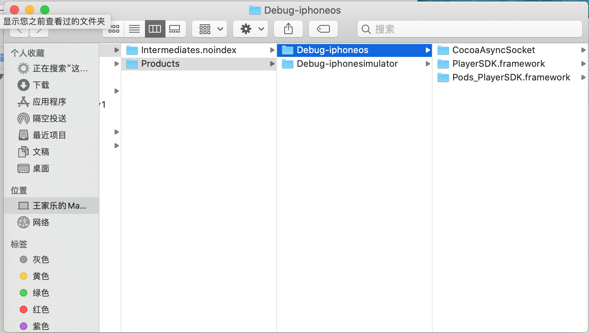

# Swift framework制作

swift   framework  SDK

**1.创建一个framework项目，选择iOS -> Framework**

## 

**2 选择iOS 下的framework，framework既包含动态库也包含静态库,之后设置库为静态**

 


**3.按照下图所示设置为静态库**

- 选择TARGET
- Bulid Setting 下搜索mach
- 修改Mach-o Tyep 的值为Dynamic Library


**4.添加脚本，编译时生成对应的framework文件**

选择Build Phases --> TARGETS --> + 添加一个New Run Scipt


脚本如下

```diff "${PODS_PODFILE_DIR_PATH}/Podfile.lock" "${PODS_ROOT}/Manifest.lock" > /dev/null
if [ "${ACTION}" = "build" ]
then
INSTALL_DIR=${SRCROOT}/Products/${PROJECT_NAME}.framework

DEVICE_DIR=${BUILD_ROOT}/${CONFIGURATION}-iphoneos/${PROJECT_NAME}.framework

SIMULATOR_DIR=${BUILD_ROOT}/${CONFIGURATION}-iphonesimulator/${PROJECT_NAME}.framework


if [ -d "${INSTALL_DIR}" ]
then
rm -rf "${INSTALL_DIR}"
fi

mkdir -p "${INSTALL_DIR}"

cp -R "${DEVICE_DIR}/" "${INSTALL_DIR}/"
#ditto "${DEVICE_DIR}/Headers" "${INSTALL_DIR}/Headers"

lipo -create "${DEVICE_DIR}/${PROJECT_NAME}" "${SIMULATOR_DIR}/${PROJECT_NAME}" -output "${INSTALL_DIR}/${PROJECT_NAME}"

#open "${DEVICE_DIR}"
#open "${SRCROOT}/Products"
fi

```

**5.framework准备工作初步完成，现给一个方法做示范**

**注意：framework开发将你需要公开出去的方法、属性、变量使用public或者open即可**

- 新建一个swift文件


 


以上是编写一个闭包回调一个数据的示例，注意public的修饰

代码更新后使用**Any iOS Device（arm64）**编译一次


**6.打开Products文件夹即可找到对应的framework文件，拖拽到项目中即可使用**

1.打开Products文件夹选中目标framework


2. 右键show in finder，找到对应文件夹，可看到有两个文件，一个是给真机调试的，一个是给模拟器调试的，可通过脚本将其合并



3.选这一个framework拖拽到工程里即可调用


**7.如果framework里需要依赖其他第三方库，推荐使用cocoapods方式引入，方法和正常开发项目一样**

注意事项： 如本次项目引入第三方**cocoaAsyncSocket** OC库依赖，无需引入Bridge桥接文件


**9.示例项目github地址**

https://github.com/wangjialePro/PlayerListSDK.git

